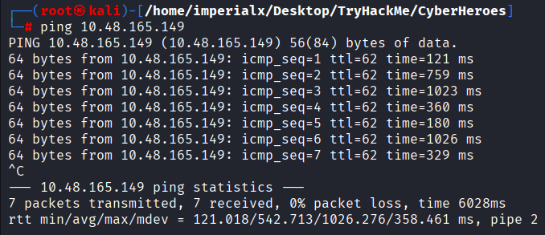
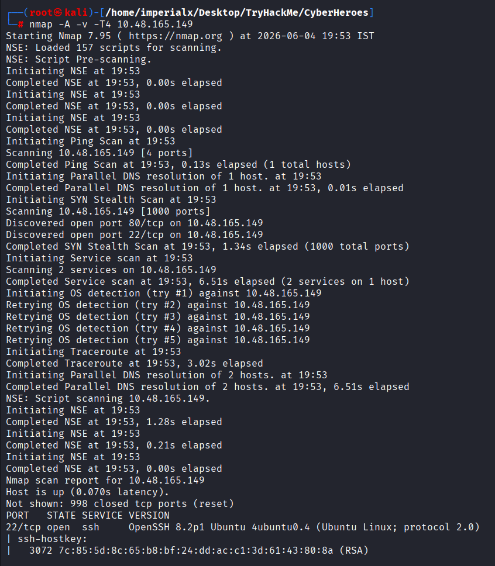
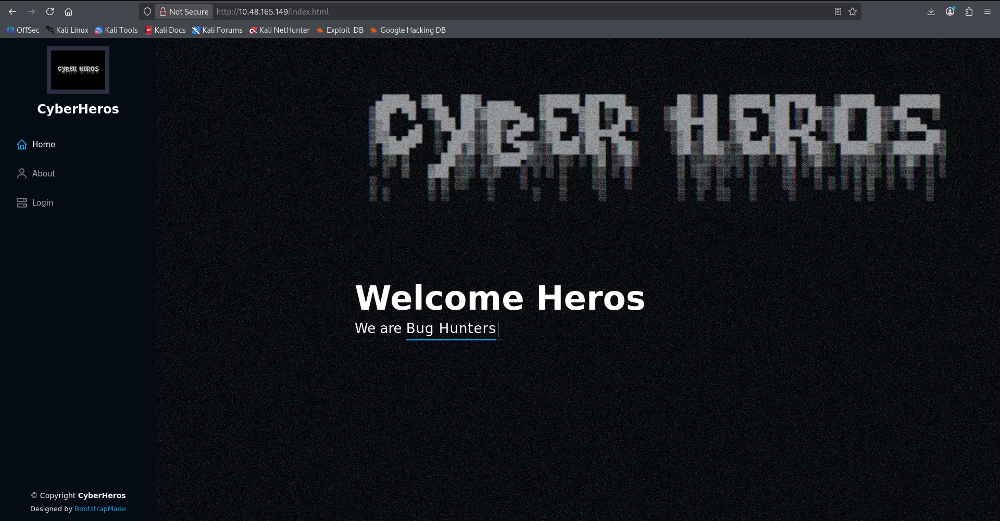
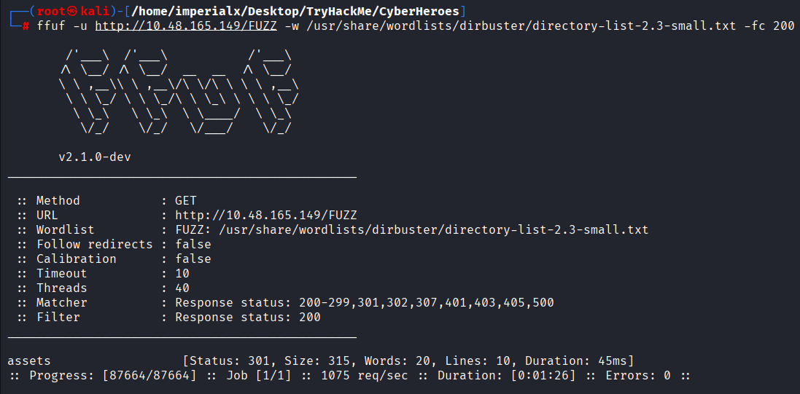
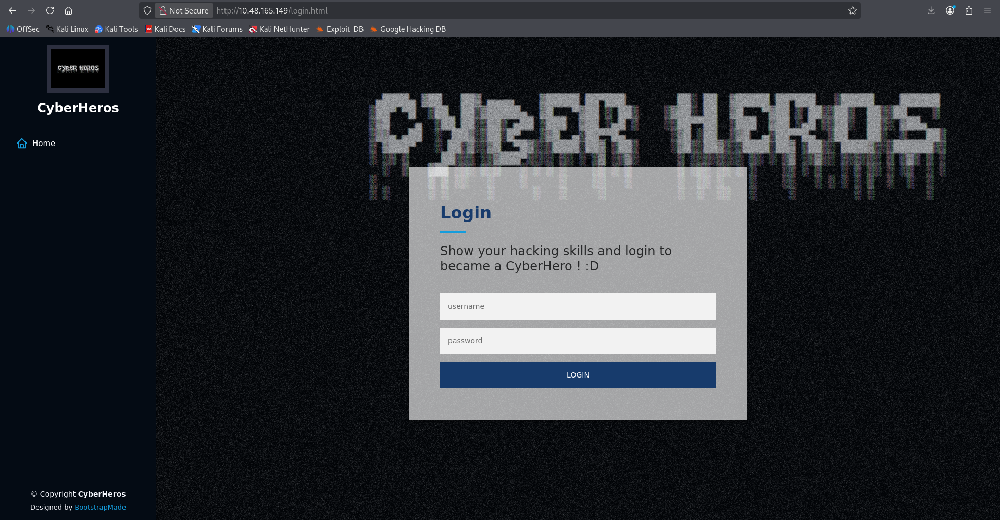
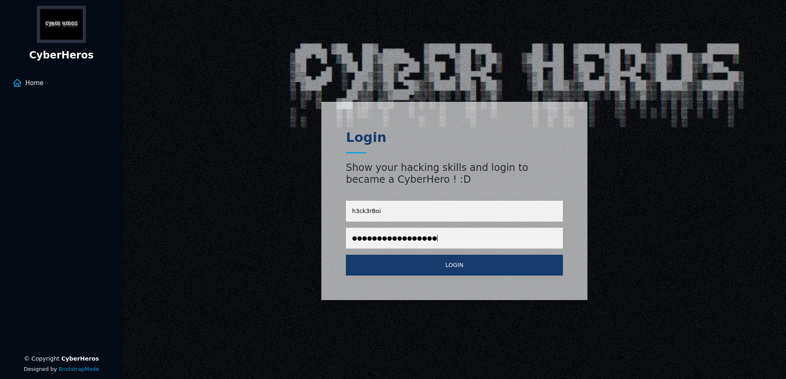
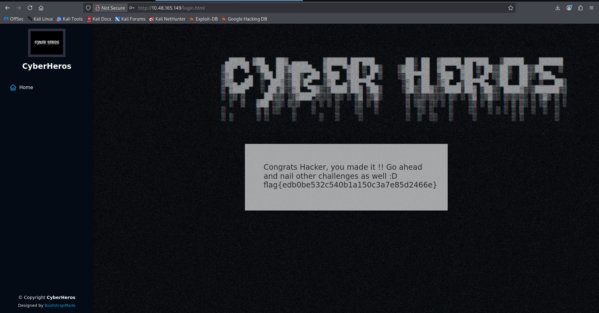

# TryHackMe - CyberHeroes Writeup

Detailed walkthrough of the CyberHeroes room on TryHackMe covering enumeration, source code review, credential discovery, authentication bypass, and flag retrieval.

---

<p align="center">
  
</p>

<p align="center">


</p>

---

# Room Information

| Room       | CyberHeroes                                               |
| ---------- | --------------------------------------------------------- |
| Platform   | TryHackMe                                                 |
| Difficulty | Easy                                                      |
| Category   | Web                                                       |
| Objective  | Retrieve the hidden flag by analyzing the web application |

---

# Objective

Gain access to the CyberHeroes portal by identifying valid credentials through source code analysis and retrieve the hidden flag.

---

# Target Information

| Parameter | Value         |
| --------- | ------------- |
| Target IP | 10.48.165.149 |

---

# Reconnaissance

## Host Verification

### Command

```bash
ping 10.48.165.149
```

### Result

```text
64 bytes from 10.48.165.149: icmp_seq=1 ttl=62
64 bytes from 10.48.165.149: icmp_seq=2 ttl=62
64 bytes from 10.48.165.149: icmp_seq=3 ttl=62
```

### Observation

The target machine was reachable.

### Screenshot



---

# Nmap Enumeration

## Command

```bash
nmap -A -v -T4 10.48.165.149 -oN nmap.txt
```

## Results

```text
22/tcp open  ssh     OpenSSH 8.2p1 Ubuntu
80/tcp open  http    Apache httpd 2.4.48
```

### Observations

* SSH service available on port 22
* Apache web server running on port 80
* Website title identified as:

```text
CyberHeros : Index
```

### Screenshot



---

# Web Enumeration

Browsing to the target revealed a CyberHeroes themed website.

### URL

```text
http://10.48.165.149
```

### Screenshot




# Directory Enumeration

## Command

```bash
ffuf -u http://10.48.165.149/FUZZ \
-w /usr/share/wordlists/dirbuster/directory-list-2.3-small.txt \
-fc 200
```

## Results

```text
assets
```

### Observation

The application exposed an assets directory containing static files such as CSS, JavaScript, and images.

### Screenshot




---

# Login Page Discovery

Navigation through the website revealed a login page.

### URL

```text
http://10.48.165.149/login.html
```

### Screenshot




---

# Source Code Analysis

Viewing the page source revealed client-side authentication logic implemented in JavaScript.

### Vulnerable Code

```javascript
function authenticate() {
    a = document.getElementById('uname')
    b = document.getElementById('pass')

    const RevereString = str => [...str].reverse().join('');

    if (a.value=="h3ck3rBoi" &
        b.value==RevereString("54321@terceSrepuS"))
    {
        ...
    }
}
```

### Key Findings

The username was hardcoded directly in the source code:

```text
h3ck3rBoi
```

The password was generated by reversing:

```text
54321@terceSrepuS
```

Reversing the string produces:

```text
SuperSecret@12345
```

---

# Credential Discovery

## Username

```text
h3ck3rBoi
```

## Password

```text
SuperSecret@12345
```

---

# Hidden Flag Path Discovery

Further analysis of the JavaScript revealed that successful authentication triggered a request to:

```javascript
RandomLo0o0o0o0o0o0o0o0o0o0gpath12345_Flag_
+h3ck3rBoi+
_SuperSecret@12345+
.txt
```

Resulting in:

```text
RandomLo0o0o0o0o0o0o0o0o0o0gpath12345_Flag_h3ck3rBoi_SuperSecret@12345.txt
```

---

# Authentication

Using the discovered credentials:

```text
Username: h3ck3rBoi
Password: SuperSecret@12345
```

Successfully authenticated to the application.

### Screenshot




---

# Flag Retrieval

Upon successful authentication, the application returned the flag.

## Flag

```text
flag{edb0be532c540b1a150c3a7e85d2466e}
```

### Screenshot



---

# Attack Path

```text
Website Discovery
        │
        ▼
Directory Enumeration
        │
        ▼
Login Page Discovery
        │
        ▼
Source Code Review
        │
        ▼
Hardcoded Username
        │
        ▼
Reversed Password Discovery
        │
        ▼
Credential Recovery
        │
        ▼
Successful Login
        │
        ▼
Hidden Flag Request
        │
        ▼
Flag Retrieved
```

---

# Flag

```text
flag{edb0be532c540b1a150c3a7e85d2466e}
```

---

# Current Progress

✅ Host Discovery

✅ Port Enumeration

✅ Directory Enumeration

✅ Login Page Discovery

✅ Source Code Analysis

✅ Credential Recovery

✅ Successful Authentication

✅ Flag Retrieval

---

# Screenshots Used

```text
screenshots/ping.png
screenshots/nmap-scan.png
screenshots/homepage.png
screenshots/ffuf.png
screenshots/login-page.png
screenshots/source-code.png
screenshots/successful-login.png
screenshots/flag.png
```

---

# Conclusion

The CyberHeroes room demonstrates a common web application security issue: relying on client-side authentication.

By reviewing the JavaScript source code, it was possible to recover both the username and password without performing any brute-force attacks. The application exposed sensitive authentication logic directly to the client, allowing attackers to reverse the password generation process and access protected content.

Key lessons learned:

* Never trust client-side authentication.
* Sensitive credentials should never be embedded in JavaScript.
* Source code review is a critical part of web application testing.
* Directory enumeration helps uncover hidden resources.
* Understanding JavaScript logic can quickly reveal authentication flaws.

This room provides an excellent introduction to web application reconnaissance, source code analysis, and client-side security weaknesses.
